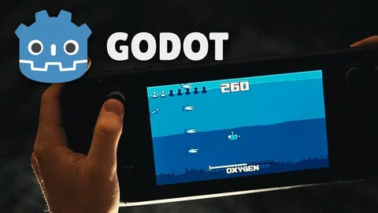

# SeaQuest – Godot 4.4.1 Project (Udemy Course Companion)

This repository contains the complete **SeaQuest** project from the Udemy course "**Godot 4: Design & Code a Retro Atari Style 2D Game, SeaQuest**" by **Parker Anderson**.

The original course does **not** include an official GitHub repository, so I created this one with **permission from the course author** to help other students follow along, compare progress, and learn more effectively.

## About the Project

- **Engine**: Godot 4.4.1  
- **Language**: GDScript
- **Course**: [Godot 4: Design & Code a Retro Atari Style 2D Game, SeaQuest](https://www.udemy.com/course/godot-4-retro-remake-design-and-code-a-seaquest-remake/) by Parker Anderson

## Purpose

This repository is intended as a learning aid for other students of the course. It includes all code and assets used in the project, faithfully recreated from the lessons.

## Repo Structure

- Each **course section** has its own branch (`section-01-project-setup`, `section-02-developing-the-player`, etc.)  
- Each **video lesson** is a separate commit within its respective branch  
- The final version of the project is available in the `main` branch (merged from all sections)  

This setup is intended to make it easy to follow the course step-by-step or explore the completed project directly.

## Notes

- All rights to course content belong to **Parker Anderson**.
- This project is **not** intended to replace the course — please consider purchasing the course to support the author and gain access to explanations, lessons, and guidance.
- If you're following the course and want to compare your own code with this version, feel free to use this repo as a reference.

## License

This project is shared under an Educational Use License with permission from the course author, **Parker Anderson**.  
See the [LICENSE](LICENSE) file for full details.